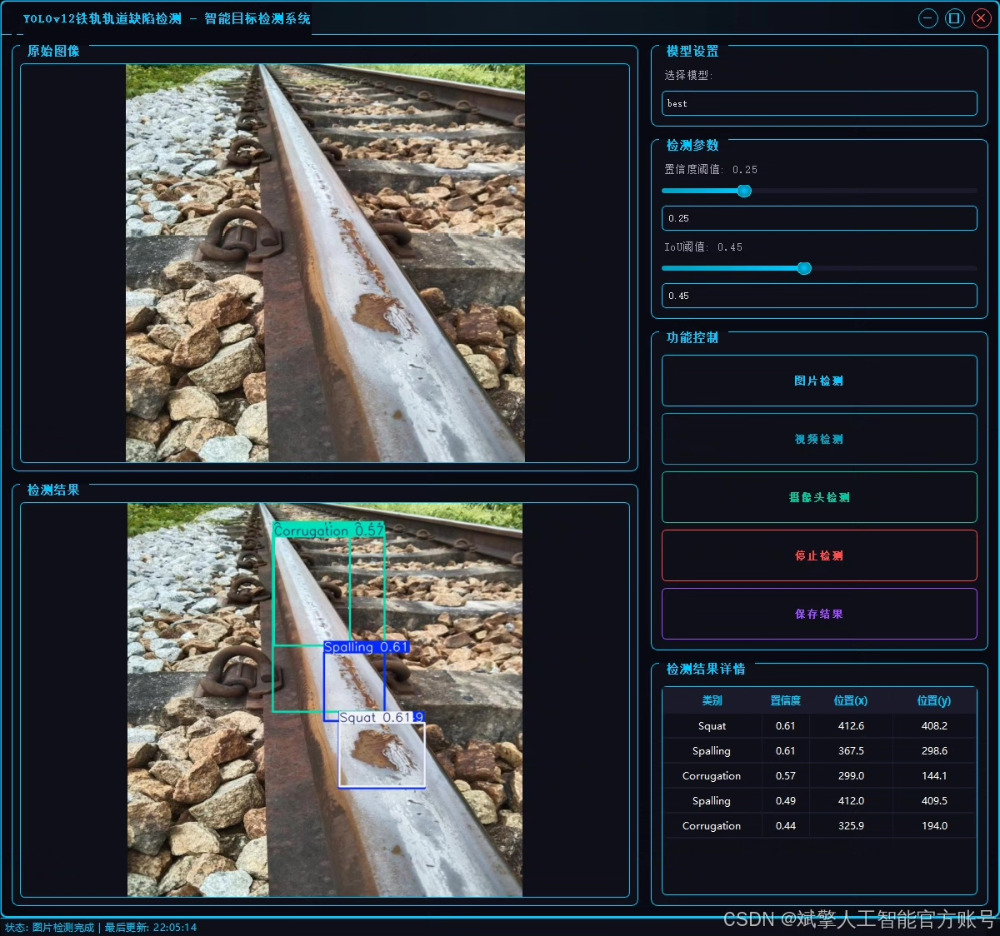
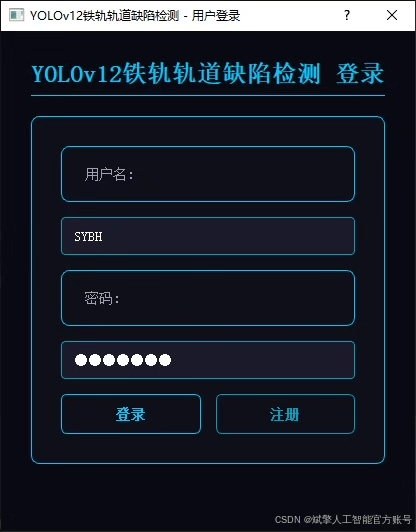
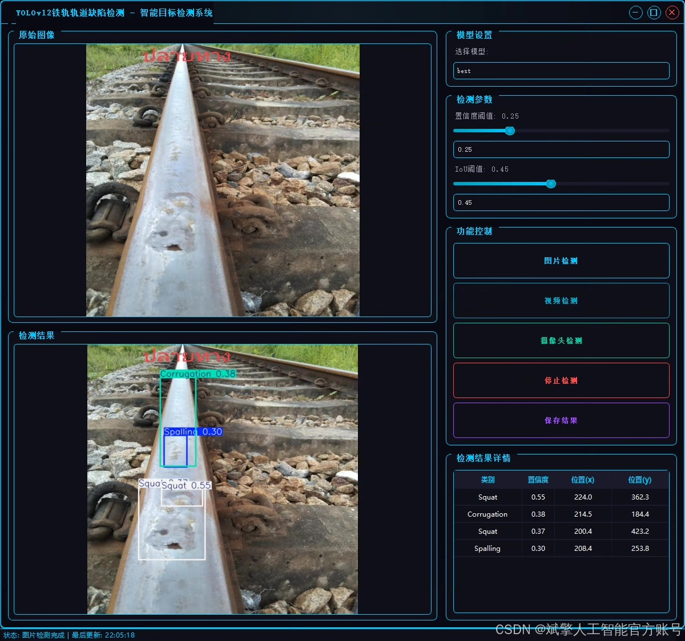
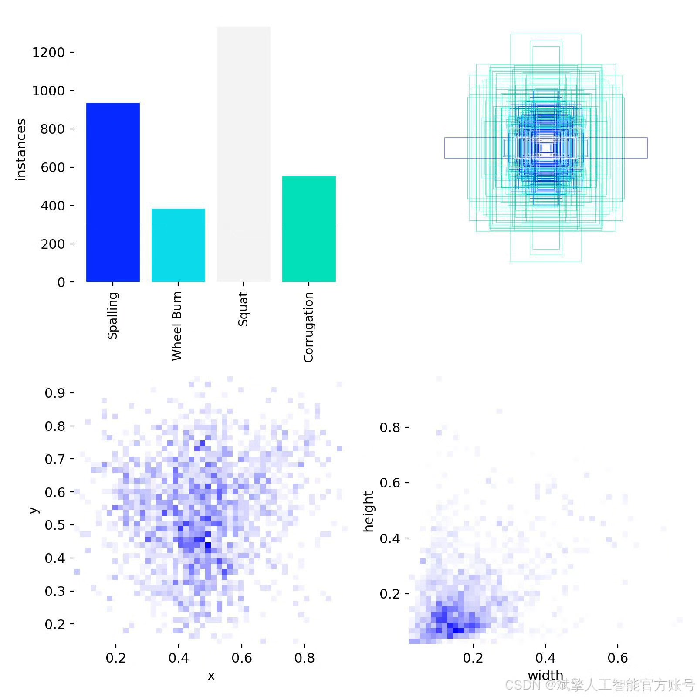
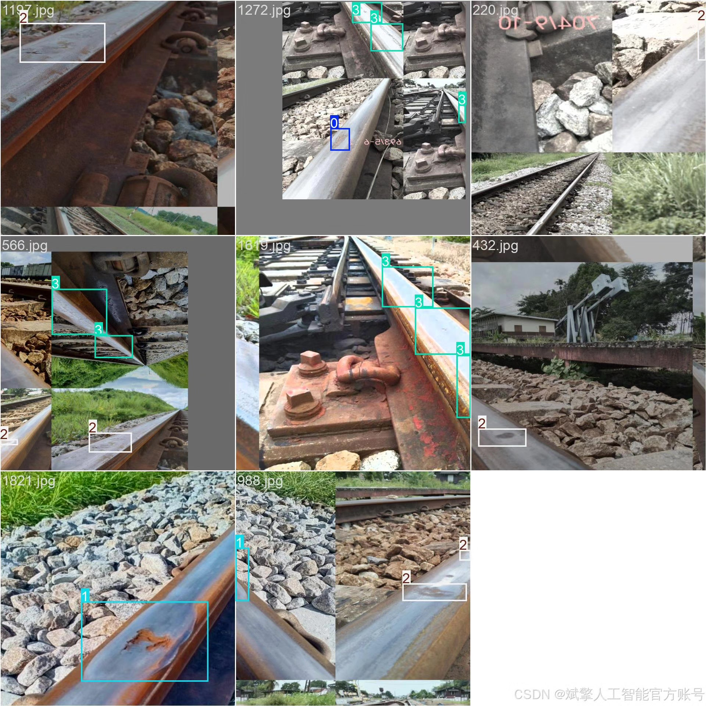
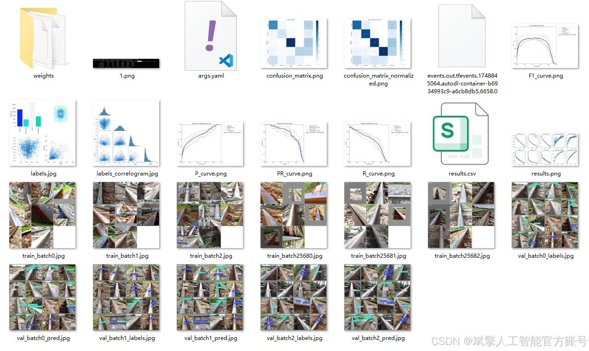
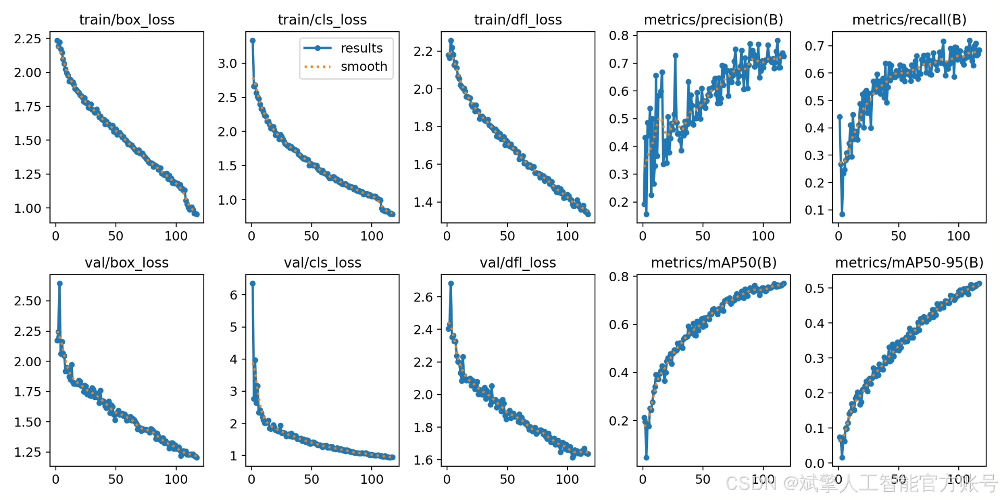
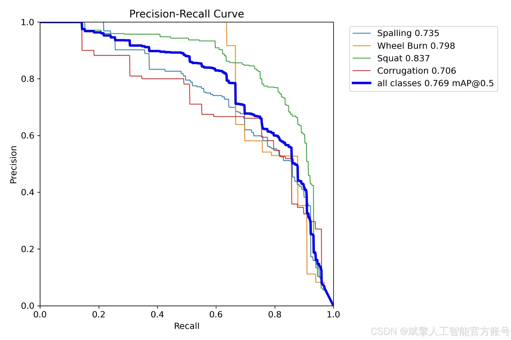
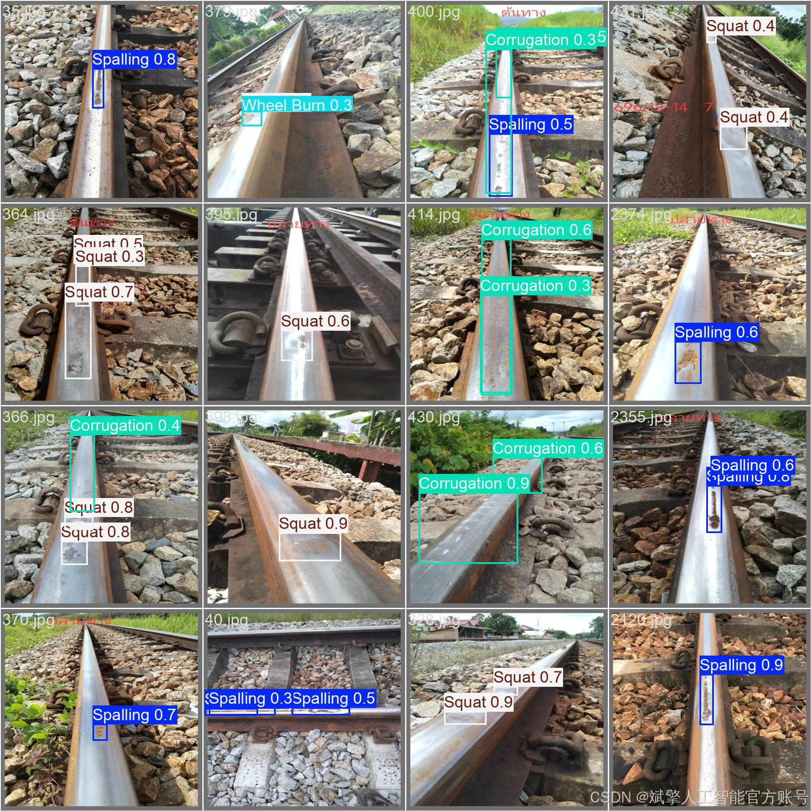

# YOLOv12 Railway Defect Detection System

## Body

YOLOv12 Railway Track Defect Detection System Based on Deep Learning

This study designs and implements a deep learning-based railway track defect detection system, using the YOLOv12 object detection model combined with an independently constructed rail defect dataset for training and validation. The dataset covers four types of typical defects: spalling (Spalling), wheel burn (Wheel Burn), squat (Squat), and corrugated (Corrugation), totaling 1916 training images, 240 validation images, and 240 test images. During the training process, the model introduces multi-scale feature fusion and improved feature pyramid network to enhance the detection accuracy of small targets and elongated defects. The system is equipped with a visual UI interface and login registration functions, supporting real-time detection and historical record query. Experimental results show that this system has high precision and real-time performance in multiple defect detection tasks, providing efficient and intelligent technical support for railway inspection.

✅ User Login and Registration: Supports password verification and security validation.
✅ Three Detection Modes: Based on the YOLOv12 model, supports image, video, and real-time camera detection, accurately identifying targets.
✅ Dual-Screen Comparison: Displays the original scene and detection results on the same screen.
✅ Data Visualization: Real-time table displaying the category, confidence, and coordinates of detected targets.
✅ Intelligent Parameter Tuning: Offers a confidence slide bar, dynamically optimizing detection accuracy to meet different scene needs.
✅ Sci-Fi Interactive Interface: Dark theme paired with dynamic light effects, reducing visual fatigue and enhancing operational experience.

## Images

## Payment

Here is a pay link on Stripe ( https://buy.stripe.com/3cs8yP7sY87d0vu9AB ). Please contact me lonlonago@foxmail.com after funding $89, and I will send you a complete data files , thank you!

